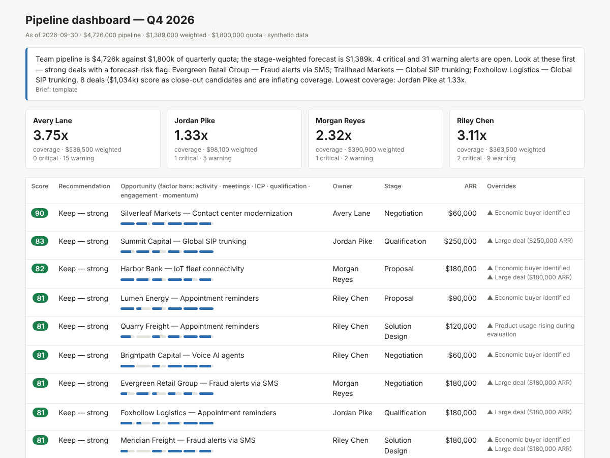
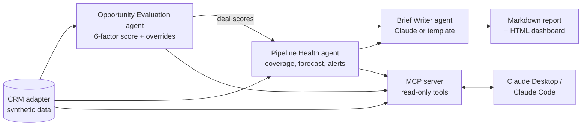

# Revenue Agents

A small multi-agent system that does a sales manager's weekly pipeline review: it scores every open deal, finds the forecast risks, and writes the brief. It includes an MCP server, so you can ask Claude about the pipeline in plain English.

This is a clean-room rebuild of a system I designed and ran in production for a sales team. It uses new code and a **fully synthetic CRM**: every company, person and number in this repo is made up.



## What it does



| Agent | Question it answers | How |
| --- | --- | --- |
| **Opportunity Evaluation** (`src/agents/opp-eval.js`) | Which deals are real? | Scores each deal 0–100 on six weighted factors, maps the score to a keep/close tier, then applies evidence-based overrides (capped at ±2 tiers). Every point is explained. |
| **Pipeline Health** (`src/agents/pipeline-health.js`) | Will we hit the number, and where is it breaking? | Per-rep coverage and stage-weighted forecast, plus prioritized alerts: past-due close dates, single-threaded late-stage deals, no economic buyer, stalled stages, serial slips, no next step, no recent activity. |
| **Brief Writer** (`src/agents/brief-writer.js`) | What should the manager do first? | Combines both agents' output into a short brief. It uses Claude when `ANTHROPIC_API_KEY` is set and a deterministic template otherwise. The model only writes prose; every number is computed upstream. |
| **MCP server** (`src/mcp-server.js`) | Can I just ask? | Exposes the agents to any MCP client as read-only tools: `list_opportunities`, `evaluate_opportunity`, `rank_deals`, `pipeline_health`. |

The agents work together. Pipeline Health uses the evaluation scores to surface **strong deals that are tripping a forecast-risk rule**. Those are the deals a manager should look at first, and neither agent finds them alone.

## Quick start

Requires Node.js 20 or later.

```bash
npm install
npm run demo        # writes reports/pipeline-report.md and reports/dashboard.html
npm test            # 10 tests, including an end-to-end MCP round trip
```

Optional:

```bash
npm run generate -- --seed 7          # a different synthetic quarter
ANTHROPIC_API_KEY=sk-... npm run demo # brief written by Claude instead of the template
node src/orchestrator.js --rep "Riley Chen"
```

A sample run is committed in [`reports/`](reports/pipeline-report.md).

## Ask Claude about the pipeline (MCP)

**Claude Code:**

```bash
claude mcp add revenue-agents -- node /absolute/path/to/revenue-agents-demo/src/mcp-server.js
```

**Claude Desktop:** add this to `claude_desktop_config.json`:

```json
{
  "mcpServers": {
    "revenue-agents": {
      "command": "node",
      "args": ["/absolute/path/to/revenue-agents-demo/src/mcp-server.js"]
    }
  }
}
```

Then try:

- "Rank Riley Chen's deals and tell me which two to close out."
- "Why is OPP-0012 scored the way it is?"
- "Which strong deals are at risk this quarter, and what's the first move on each?"

## The scoring model

| Factor | Weight | Signal |
| --- | ---: | --- |
| Recent activity (14 days) | 20 | Emails, calls and meetings, weighted by type |
| Meeting evidence (30 days) | 20 | Customer meetings, weighted by attendance |
| ICP fit | 15 | Target industry, company size, technographic signals |
| Qualification depth | 15 | Pain, use case, champion, economic buyer, next step |
| Engagement breadth | 15 | Number of engaged contacts (multi-threading) |
| Deal momentum | 15 | Time in stage against the expected window, close-date slips |

| Score | Recommendation |
| --- | --- |
| 81–100 | Keep — strong |
| 61–80 | Keep — active |
| 41–60 | Keep — watch |
| 26–40 | Close out (soft) |
| 0–25 | Close out |

**Overrides** move the recommendation one tier each, with a net cap of two:
- **Up:** economic buyer identified, deal of $150k ARR or more, product usage rising.
- **Down:** no contact in 60+ days, close date pushed 3+ times, usage declining, close date already past.

## Design choices

- **Explainable over clever.** A manager has to defend a close-out recommendation to a rep, so every score shows its factors and every override shows its reason.
- **LLMs write; code counts.** The model never calculates a number. It gets computed results and turns them into prose, which keeps the brief auditable and cheap.
- **Read-only by default.** The MCP server can't write to the CRM. Write access belongs behind a human approval step.
- **Swappable data layer.** Agents only call the small interface in `src/lib/crm.js`. Pointing them at Salesforce or HubSpot means reimplementing those methods and nothing else.

## In production

The production version this is based on ran on an OpenClaw agent runtime with eight specialized agents, including opportunity evaluation, pipeline health, outbound orchestration, channel intelligence and sales ops. It pulled from Salesforce, Salesloft, Google Calendar and Drive transcripts, and Slack. It delivered alerts to Slack and Telegram and fed a React and SQLite dashboard for the sales team. This repo keeps the core decision logic and the agent pattern without any of the private data.

## Layout

```
data/generate.js            synthetic CRM generator (seeded, reproducible)
src/lib/                    CRM adapter, business rules, helpers
src/agents/                 opp-eval, pipeline-health, brief-writer
src/orchestrator.js         runs the agents and writes reports
src/report.js               Markdown + HTML renderers
src/mcp-server.js           MCP server over stdio
test/                       node:test suite
```

## License

MIT
